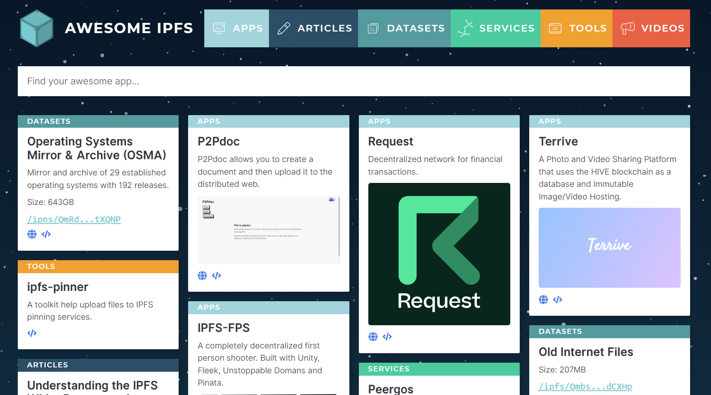

标题|简介
|---|---|
IPFS技术文档|IPFS，星际文件系统的开发者技术文档主页 

# 欢迎来到IPFS的技术文档  

星际文件系统（Interplanetary File System：IPFS）是一个去中心化的文件系统，建立全新的互联网时代。[Filecoin](https://filecoin.io/)和许多著名的Web3项目都使用了IPFS。有些人称IPFS为区块链和Web3的硬盘，但它的威力不仅仅如此。  

## 开始  

查阅以下篇章，认识IPFS： 

- IPFS是什么？ 
- 概念  
- 实例探究  
- 指南  
- API和CLI
- 下载IPFS  

你也可以查看词汇表，上面记载了IPFS的专有名词和概念的简单含义。  

## 下载IPFS的工具  

这些工具可以帮助你更快、更高效地使用和构建IPFS——今天就试试吧！ 

Browser Companion|IPFS电脑版本|IPLD浏览器 
|---|---|---| 
||

## 在IPFS上托管你的网站 

使用IPFS托管你的静态网站，保护自己免受单点故障风险，并从这去中心化的基础设施中受益。如果你是IPFS的小白，那么这里是你学习如何在去中心化网络进行开发的好地方。  

## 学习更多关于去中心化网络  

想了解更多关于去中心化网络 (DWeb) 以及它是如何改变互联网的吗？这些资源将让你更清楚地了解DWeb的趋势，以及它如何改变这个世界： 

- 什么是IPFS 
- 点对点分享  
- 使用内容寻址技术定位数据 

前往“概念”篇章查阅更多相关指南 →  

::: 呼吁  
ProtoSchool的[有趣教程](https://proto.school/tutorials)将会教导你关于去中心化网络的概念，协议和各种工具。完成ProtoSchool IPFS课程里的编码挑战，探索JS-IPFS APIs，或者参与DWeb概念和IPFS相关项目的介绍（无需编码）。  
:::

## 看看其他人都在开发什么  

还在找寻灵感？你可以在Awesome IPFS上看到许多由社区成员开发的有趣项目。 

[前往Awesome IPFS查看 →](https://awesome.ipfs.io/) 

## 成为IPFS的社区成员  

IPFS是由设计师，开发人员，作家和活动家组成的一个强大社区，他们都在帮助改进此项目。你可以通过参加本地聚会，在会议上提供帮助，通过[Discord](https://discord.com/invite/KKucsCpZmY) 在线聊天或加入[IPFS的论坛](https:// /discuss.ipfs.io/)。

前往“社区”篇章查看更多 →

