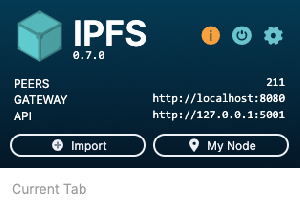
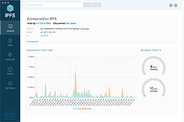
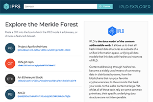

标题|简介
|---|---|
IPFS技术文档|IPFS，星际文件系统的开发者技术文档主页 

# 欢迎来到IPFS的技术文档  

星际文件系统（Interplanetary File System：IPFS）是一个去中心化的文件系统，建立全新的互联网时代。[Filecoin](https://filecoin.io/)和许多著名的Web3项目都使用了IPFS。有些人称IPFS为区块链和Web3的硬盘，但它的威力不仅仅如此。  

## 开始  

查阅以下篇章，认识IPFS： 

- IPFS是什么？ 
- 概念  
- 实例探究  
- 指南  
- API和CLI
- 下载IPFS  

你也可以查看词汇表，上面记载了IPFS的专有名词和概念的简单含义。  

## 下载IPFS的工具  

这些工具可以帮助你更快、更高效地使用和构建IPFS——今天就试试吧！ 

网络伴侣|IPFS电脑版本|IPLD浏览器 
|---|---|---| 
||

