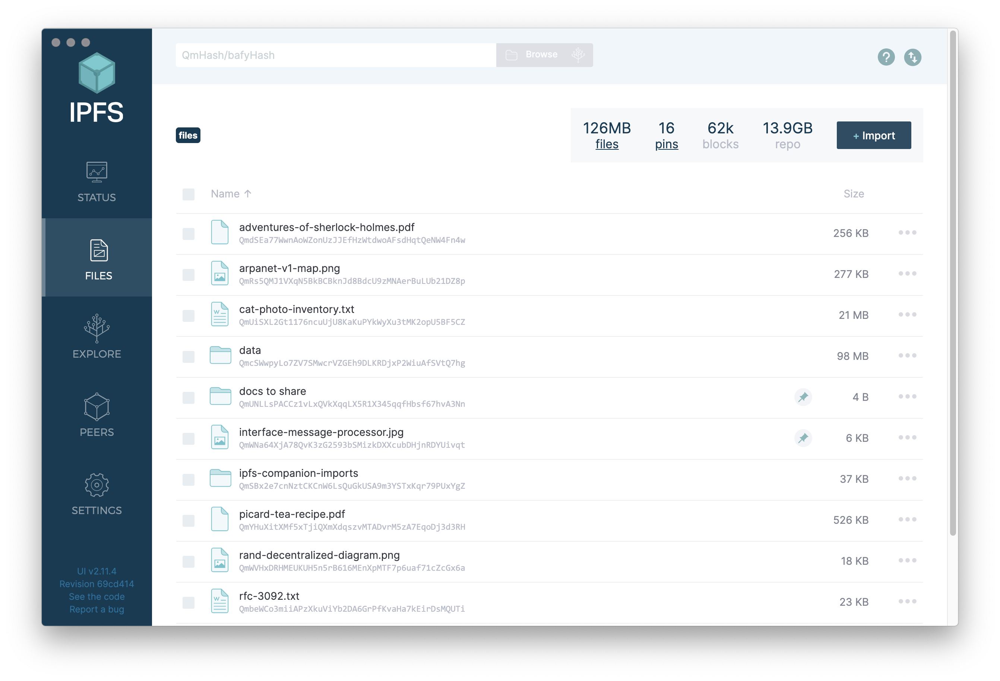
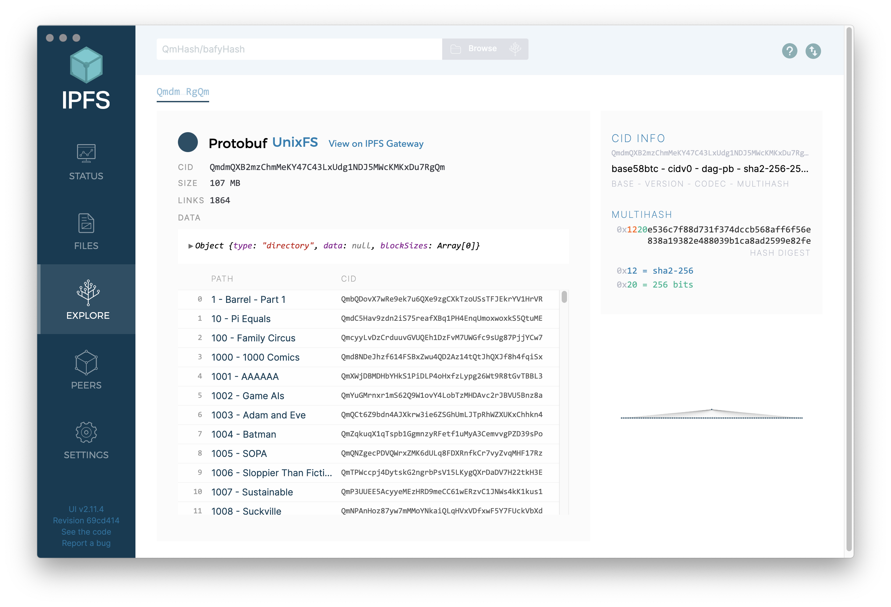
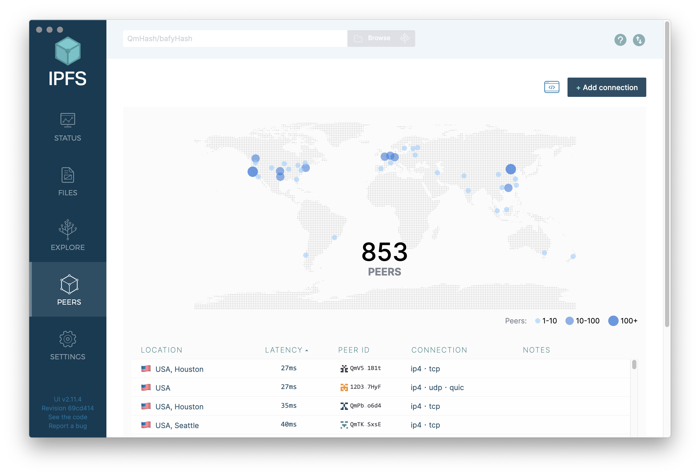
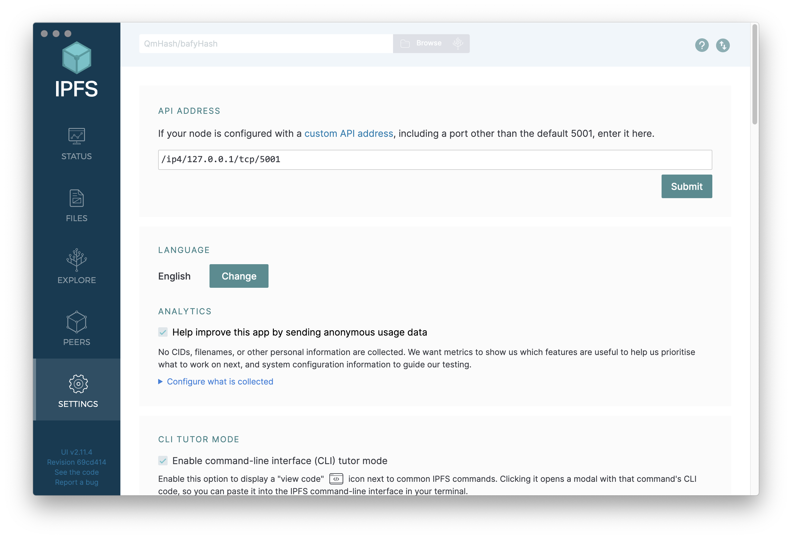
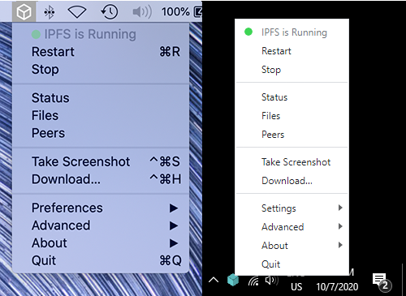

标题|简介
|---|---|
IPFS桌面版|IPFS桌面版在应用程序中为你提供了IPFS的所有功能--一个完整的IPFS节点，加上易上手的操作系统菜单快捷方式和一个多合一的文件管理器、同伴管理和内容资源管理器。| 

# IPFS桌面版

**IPFS桌面版将IPFS节点、文件管理器、对等体管理器和内容资源管理器整合在一个单一的、易于使用的应用程序中。**

使用IPFS桌面版来熟悉IPFS，而不需要接触终端——或者，如果你已经有一定的经验，可以在命令行旁使用强大的菜单栏/任务栏快捷键，使你的IPFS工作流程更快。

如果你的电脑上已经有一个IPFS节点，IPFS桌面版将作为该节点的控制面板和文件浏览器。如果你还没拥有一个节点，它将为你安装一个。无论哪种方式，IPFS桌面版都会自动检查更新。

文件页面|浏览页面|同伴页面|设定页面|菜单栏/任务栏
|---|---|---|---|---|
| |  |  |  |  |
