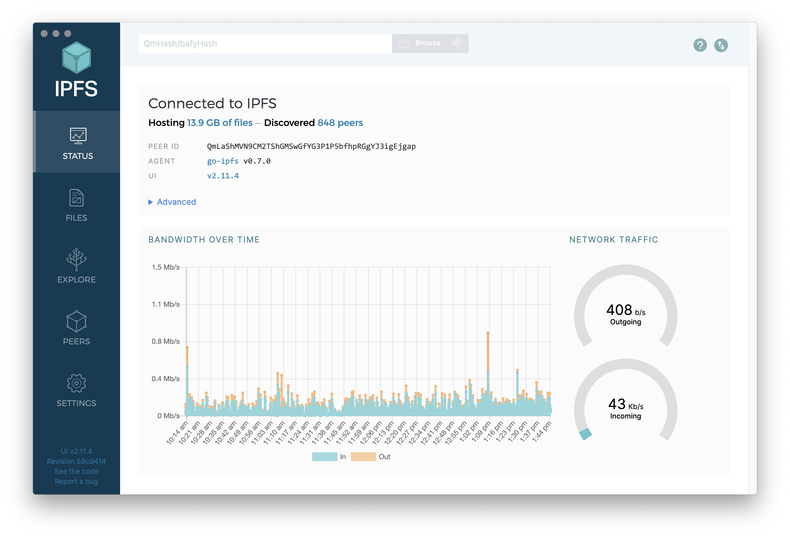
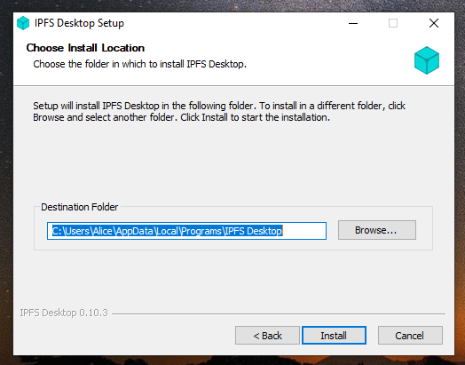
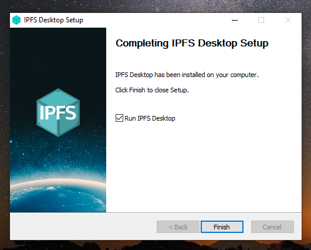

标题|简介
|---|---|
IPFS桌面版|IPFS桌面版在应用程序中为你提供了IPFS的所有功能--一个完整的IPFS节点，加上易上手的操作系统菜单快捷方式和一个多合一的文件管理器、同伴管理和内容资源管理器。| 

# IPFS桌面版

**IPFS桌面版将IPFS节点、文件管理器、对等体管理器和内容资源管理器整合在一个单一的、易于使用的应用程序中。**

使用IPFS桌面版来熟悉IPFS，而不需要接触终端——或者，如果你已经有一定的经验，可以在命令行旁使用强大的菜单栏/任务栏快捷键，使你的IPFS工作流程更快。

如果你的电脑上已经有一个IPFS节点，IPFS桌面版将作为该节点的控制面板和文件浏览器。如果你还没拥有一个节点，它将为你安装一个。无论哪种方式，IPFS桌面版都会自动检查更新。

文件页面|浏览页面|同伴页面|设定页面|菜单栏/任务栏
|---|---|---|---|---|
| |  |  |  |  |

### 特色亮点

- **在系统启动时启动你的节点（Mac/Windows），并使用便捷的菜单栏/系统托盘菜单从你的操作系统**控制它。
- **以各种快捷的方式导入文件、文件夹和屏幕截图到IPFS**，包括拖放和（对于Windows）右键单击文件/文件夹的图标。
- **通过熟悉的文件浏览器轻松管理你的节点内容**，该浏览器提供了许多快捷方式例如：重命名/移动/锁定文件和文件夹、直接在IPFS桌面上预览各种常见的文件格式、和将内容ID或可共享的链接复制到你的剪贴板等。
- **快速下载CIDs、IPFS路径和IPNS路径** - 通过右击电脑的菜单栏上IPFS图标选择 "下载..."，粘贴一个哈希值，就完成了。
- **在地图上显示你在世界各地的IPFS同伴**，显示你连接到哪些节点，它们的地点，它们使用的连接，以及更多。
- **探索IPFS文件的 "Merkle森林 "**，它让你亲眼看到存储在IPFS上的例子数据集——或你自己的IPFS文件——是如何被分解成内容地址的碎片。
- **各大操作系统对IPFS文件和链接的支持**（在Mac、Windows和一些Linux系统上）自动将以`ipfs://`、`ipns://`和`dweb:`开始的链接在IPFS桌面版中打开。
- **CLI导师模式**帮助你边走边学习IPFS命令。

### 安装说明

如果你想要安装IPFS桌面版，请遵循你的操作系统的具体说明。IPFS桌面版是使用[Electron框架](https://www.electronjs.org)构建的，因此该应用程序应该在Electron可运行的地方正常运行。

[Windows](#windows) | [macOS](#macos) | [Ubuntu](#ubuntu)  
|---|---|---|
|  |  |  |

或者，如果你想使用一个软件包管理器，请查看这个由IPFS社区维护的[第三方软件包列表](#软件包管理器)。

## Windows

1. 进入[IPFS桌面版下载页面](https://github.com/ipfs/ipfs-desktop/releases)
2. 找到以`.exe`结尾的IPFS桌面版最新版本的链接。

   

3. 运行`.exe`文件，开始安装。
4. 选择是否只为你自己还是为电脑上所有用户安装该应用程序。点击**下一步**。

   

5. 选择应用程序的安装位置。默认位置通常是没问题的。点击**下一步**。

   

6. 等待安装完成并点击**完成**。

   

7. 现在你可以在状态栏中找到一个IPFS图标。

   ！[Windows状态栏中的IPFS桌面版状态栏菜单。](./图像/IPFS桌面版/install-windows-ipfs-desktop-status-bar.png)

IPFS桌面版应用程序已完成安装。你现在可以开始[添加你的网站]（）。
