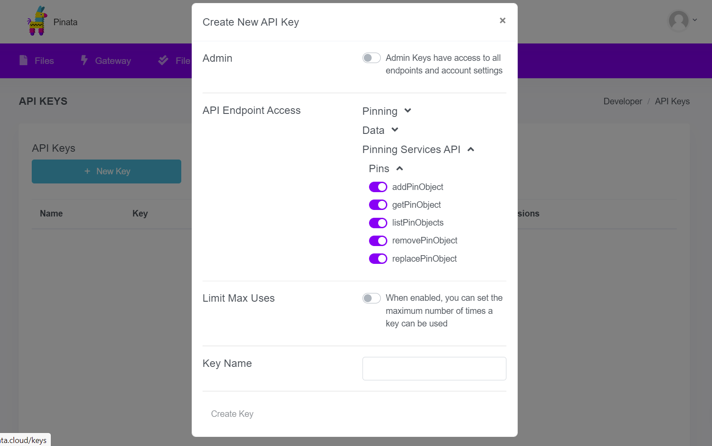

标题|简介
|---|---|
使用IPFS铸造NFT|非同质化代币（NFT）允许用户创造和交易不同价值的数字资产。从零开始学习如何铸造一个NFT并且把它储存在IPFS，并且学习如何使用Pinata的远程锁定服务。  

# 使用IPSFS铸造NFT  

非同质化代币（NFT）允许用户创造和交易不同价值的数字资产。从零开始学习如何铸造一个NFT并且在远程锁定服务，像是Pinata和nft.storage的帮助下把它储存在IPFS。  

由于IPFS并不是一个区块链，我们会在这个教程使用以太坊。但是不仅仅是以太坊，我们也能把本次的教程轻松套用在别的区块链上。  

## NFT简介  

本次教程不会深入讲解NFT或者讨论其重要性和潜能。本次教程仅仅是帮助你学习如何使用IPFS托管你的NFT，并且了解这个过程是如何扩展至区块链开发的其它方面。  

因此，我们会尝试概况最基本的NFT知识，以确保大家是在同一个频道上。如果你想学习更多关于创造NFT的最佳实践和开发过程，可以前往[NFT School](https://nftschool.dev)。  

### NFT是如何组成的   

不论是什么平台，NFT拥有着几个关键特征。  

首先，每个非同质化代币拥有自己独一无二的编号，用于在其他代币之间区别自己。这跟同质化代币有非常鲜明的对比，像是以太 `ETH`，以一个数量存在于户口或者钱包。我们不能区别每个`ETH`。正因为NFT是独一无二的，它们是被独立交易和独立拥有的，而智能合约负责追踪是谁拥有这些NFT。  

另一个NFT的关键特征是它可以于储存在智能合约外的数据做链接。储存并且处理智能合约外的数据我们称之为 _链下_（off-chain）。这是因为凡是储存在链上的数据都需要被处理，验证，和广播到整个区块链网络，导致储存巨大的数据是非常昂贵的。NFT的应用就存在了这个问题，尤其是当NFT代表着一些艺术画作和收藏品，那么保存它们可以花费上百万美金。  

### IPFS如何解决问题  

当创建NFT并将其链接到存在于其他系统上的数字资产时，那么链接数据的方式就非常的关键。有几个原因导致了传统的HTTP链接并不适合应用。  

例如像这样的HTTP地址 `https://cloud-bucket.provider.com/my-nft.jpeg`，只要服务器的主人支付账单，任何人都可以获取 `my-nft.jpeg` 的内容。但是，我们永远无法保证 `my-nft.jpeg` 的内容与创建NFT时的内容是相同的。那是因为，服务器的主人可以随时将 `my-nft.jpeg` 替换为完全不同的图像，从而导致NFT失去了原有所代表的含义。  

这种称为“跑路”的事件也曾经发生过。一名画家创建了自己的NFTs并且卖出后，就把原本的图像进行替换，再把原图卖给其他人。  

IPFS通过内容寻址技术解决了这个问题。当你把数据保存到IPFS，IPFS会基于你的数据内容生成一个内容标识（content identifier: CID），而内容标识是链接到你刚上传到IPFS的数据。由于每个CID只能指向一个内容，并且是独一无二的，因此我们也不必害怕内容被替换或者篡改。  

当你使用CID，即使原著消失了，只要IPFS网络上存在着至少一份你想要的数据，你都能成功获取这份数据。这使得CIDs非常适合用于储存NFT。我们需要做的就只是把CID输入在 `ipfs://` 的统一资源标志符（URI）：`ipfs://bafybeidlkqhddsjrdue7y3dy27pu5d7ydyemcls4z24szlyik3we7vqvam/nft-image.png`。这样，就拥有了一个从区块链至代币数据之间无法被破坏的链接了。  

当然，在某些情况之下，我们会想要再发布了NFT后更新其元数据。这完全办得到！你只需要在智能合约中添加一个机制，那就是在每次更新代币的数据后自动更新URI。这将让你旧的IPFS URI更改为新的URI，同时初始版本的记录仍然在区块链的交易历史中保留下来。这增加了透明度，并让每个人都清楚知道更改了什么内容、何时以及由谁更改。   

## Minty  

为了更方便讲解NFTs和IPFS是如何互相配合和运作的，我们开发了Minty。Minty是一个简单的命令行应用程序，能够自动铸造NFT并利用[Estuary](https://estuary.tech/)，[nft.storage](https://nft.storage)，或[Pinata](https://pinata.cloud)把其数据在IPFS进行锁定。  

NFT平台的运作是较为复杂的。在当今的网络应用程序，我们需要围绕在我们选择的技术栈上做不同的决定，用户界面的规格，API的社交等等。链接区块链的去中心化应用程序（d-apps）还需要和用户钱包，例如[Metamask](https://metamask.io)互动，大大增加了开发的复杂程度。  

但既然Minty的出现是要演示使用IPFS来创建NFT的概念和过程，因此我们不需要专注于现代去中心化应用程序的开发。Minty就只是一个使用Javascript编写的命令行应用程序。  

### 下载Minty  

让我们一起下载Minty，开始动手创建NFTs！首先，你先需要下载NPM，才能下载并且运行Minty。目前Windows系统是不支持的。下载Minty的方法非常简单。你只需要下载其Github的仓库，再下载NPM dependencies，就能开始开启本机的测试环境。　　

1. 复制Minty的仓库，并且进入命名为 `minty` 的目录：　

   ```shell
   git clone https://github.com/yusefnapora/minty
   cd minty
   ```

2. 下载NPM dependencies：

    ```shell
    npm install
    ```

3. 添加 `minty` 命令到 `$PATH`。这并不是必须做的步骤，但能让你在电脑的不同角落都能运行Minty：

    ```shell
    npm link
    ```

4. 运行 `start-local-environment.sh` 脚本，以便能开始运行以太坊的本机测试网和IPFS daemon：

    ```shell
    ./start-local-environment.sh
    > Compiling smart contract
    > Compiling 16 files with 0.7.3
    > ...
    ```

    这个指令会不断运行下去。接下来更多的命令都需要输入到新的终端窗口。　
    
### 部署智能合约

在运行任何其他的 `minty` 命令之前，您需要部署一个智能合约：　　

```shell
minty deploy
> deploying contract for token Julep (JLP) to network "localhost"...
> deployed contract for token Julep (JLP) to 0x5FbDB2315678afecb367f032d93F642f64180aa3 (network: localhost)
> Writing deployment info to minty-deployment.json
```

这将部署到 `hardhat.config.js` 中配置的网络，默认情况下设置为 `localhost` 网络。如果您收到有关无法访问网络的报错，请确保你使用 `./start-local-environment.sh` 启动了本机开发网络。　　

部署此合约时，部署的地址和其他信息将写入`minty-deployment.json`。这个文件必须存在，才能使后续命令正常运行。

### 铸造NFT

一旦你运行了本地以太坊网络和IPFS daemon，铸造NFT就变得非常简单了。只需指定你想要代币化－_tokenize_ 的东西，NFT的名称，然后添加描述以告诉用户NFT的用途。　　

#### 准备用于铸造的素材　

首先，我们来准备用于铸造NFT的素材。NFTs有非常广泛的应用场景，你可以选择任何东西用于铸造！举个例子，我们来铸造一张同往月球的机票！　　

1. 创建一个命名为 `flight-to-the-moon.txt`　的文件：

    ```shell
    touch ~/flight-to-the-moon.txt
    ```

2. 开启文件，输入一些机票的信息：

    ```
    THE INTERPLANETARY TRAVEL COMPANY
    ---------------------------------
    Departing: Cape Canaveral, Earth
    Arriving: Base 314, The Moon
    Boarding time: 17:30 UTC
    Seat number: 1A
    Baggage allowance: 5kg 
    ```

3. 保存，关闭文件。

#### 铸造文件  

现在我们要代币化我们的NFT机票。这个过程我们称之为铸造。　

1. 呼叫 `mint` 命令，提供我们想要铸造的文件，NFT名称和描述： 

   ```shell 
    minty mint ~/flight-to-the-moon.txt --name "Moon Flight #1" --description "This ticket serves as proof-of-ownership of a first-class seat on a flight to the      moon."
    > 🌿 Minted a new NFT:
    > Token ID:              1
    > Metadata URI:          ipfs://bafybeic3ui4dj5dzsvqeiqbxjgg3fjmfmiinb3iyd2trixj2voe4jtefgq/metadata.json
    > Metadata Gateway URL:  http://localhost:8080/ipfs/bafybeic3ui4dj5dzsvqeiqbxjgg3fjmfmiinb3iyd2trixj2voe4jtefgq/metadata.json
    > Asset URI:             ipfs://bafybeihhii26gwp4w7b7w7d57nuuqeexau4pnnhrmckikaukjuei2dl3fq/flight-to-the-moon.txt
    > Asset Gateway URL:     http://localhost:8080/ipfs/bafybeihhii26gwp4w7b7w7d57nuuqeexau4pnnhrmckikaukjuei2dl3fq/flight-to-the-moon.txt
    > NFT Metadata:
    > {
    >   "name": "Moon Flight #1",
    >   "description": "This ticket serves as proof-of-ownership of a first-class seat on a flight to the moon.",
    >   "image": "ipfs://bafybeihhii26gwp4w7b7w7d57nuuqeexau4pnnhrmckikaukjuei2dl3fq/flight-to-the-moon.txt"
    > }
    ``` 
      `minty mint`命令返回了新铸造代币的id，一些我们所提供的元数据（包含了 `name` 和 `description`），和指向包含了我们NFT的文件的IPFS URI。`Metadata URI`显示的IPFS URI是指向储存在IPFS的JSON格式NFT元数据。  

好棒！我们创建了属于自己的NFT，但是唯有你的IPFS节点继续运行，其他人才能获取。如果你关闭了你的电脑又或者处于离线状态，那么没人可以看得到你的NFT！想要解决这个问题，我们就需要使用一个锁定服务来锁定这个NFT。

### 锁定你的NFT

为了不24小时全天候运行本地IPFS daemon，但又同时确保数据的可用性，那么我们可以选择请求远程锁定服务在他们的IPFS节点上保存一份我们的IPFS数据。  

所有支持IPFS远程锁定API的锁定服务都能搭配Minty使用。  

下面我们将演示如何将Minty配置到两种不同的锁定服务。下方的锁定服务均可以使用，因此你只需注册其中一个进行尝试即可。 

#### 选项1：Pinata 

Pinata是最悠久且最出名的远程锁定服务，加上它们有提高免费的储存空间，非常方便我们注册后进行尝试。 

##### 注册Pinata  

想要使用Pinata锁定你的数据，你先要注册一个账户。

1. 前往[pinata.cloud](https://pinata.cloud/)。

2. 点击**注册**并且使用你的电邮创建一个账户。

Pinata会给予每个用户1GB的免费储存空间，这对于储存几个NFTs是足够的了。

##### 获得API密钥

你需要从Pinata那儿获得API密钥。这个API密钥能让你用Minty和你的Pinata账户做互动。  

1. 登录Pinata，在菜单选择**API keys**。

2. 点击**New Key**。

3. 展延**Pinning Services API**，选择所有**Pins**下方的选项： 

  

4. Pinata会给你 _API key_ ，_API secret_，和 _JWT_： 

    ```
    API Key: 43537d17e88805007086
    API Secret: 492b24f041b9120cbf8e35a247fb686793231a3d89045f1046a4f5b2d2175082
    JWT: eyJhbGciOiJIUzI1NiIsInR5cCI6IkpXVCJ9.eyJ1c2VySW5mb3JtYXRpb24iOnsiaWQiOiJiZDQ3NjM1Ny1lYWRhLTQ1ZDUtYTVmNS1mM2EwZjRmZGZmYmEiLCJlbWFpbCI6InRhaWxzbm93QHByb3Rvbm1haWwuY29tIiwiZW1haWxfdmVyaWZpZWQiOnRydWUsInBpbl9wb2xpY3kiOnsicmVnaW9ucyI6W3siaWQiOiJGUkExIiwiZGVzaXJlZFJlcGxpY2F0aW9uQ291bnQiOjF9XSwidmVyc2lvbiI6MX0sIm1mYV9lbmFibGVkIjpmYWxzZX0sImF1dGhlbnRpY2F0aW9uVHlwZSI6InNjb3BlZEtleSIsInNjb3BlZEtleUtleSI6IjQzNTM3ZDE3ZTg4ODA1MDA3MDg2Iiwic2NvcGVkS2V5U2VjcmV0IjoiNDkyYjI0ZjA0MWI5MTIwY2JmOGUzNWEyNDdmYjY4Njc5MzIzMWEzZDg5MDQ1ZjEwNDZhNGY1YjJkMjE3NTA4MiIsImlhdCI6MTYxNjAxMzExNX0.xDV9-cPwDIQInuiB0M--XiJ8dQwwDYMch4gJbc6ogXs
    ```
    我们只需要`JWT`。目前，你可以忽略`API Key`和`API Secret`。 
    
5. 复制 `config/pinata.env.example`文件至`config/.env`： 
   
   ```shell
   cp config/pinata.env.example config/.env
   ```
   
6. `config/.env`里头，在`PINNING_SERVICE_KEY`的双引号`"`中间添加你的JWT： 

    ```shell
    PINNING_SERVICE_KEY="eyJhbGciOiJIUzI1NiIsInR5cCI6IkpXVCJ9.eyJ1c2VySW5mb3JtYXRpb24iOnsia..."
    ```

7. Minty现已成功链接你的Pinata账户，并且可以锁定NFT数据至你的账户上。  

#### 选项2：nft.storage 

[nft.storage](https://nft.storage)是由Protocol Labs所提供，用于存储公共NFT数据的新服务。目前，它是一个免费的公测版本，因此注册和试用都非常容易。 

##### 注册nft.storage  

要使用nft.storage，你需要注册一个账户。如果你还没有GitHub账户，你也需要创建一个用于登录。  

1. 前往[nft.storage](https://nft.storage)。

2. 点击**注册**，并且使用你的Github账户进行注册。  

##### 获取API密钥 

你需要从nft.storage获取API密钥。

1. 登录nft.storage，在菜单上选择**Manage API Keys**。

2. 点击**New Key**。 

3. 新的密钥将会显示，复制密钥。密钥是一串 `ey...` 开头的字符串。 

我们需要把API密钥放入一个Minty能找到的文件。

1. 复制 `config/nft.storage.env.example`文件至`config/.env`：

    ```shell
    cp config/nft.storage.env.example config/.env
    ```

2. `config/.env`里头，在`PINNING_SERVICE_KEY`的双引号`"`中间添加你的API密钥： 

    ```shell
    PINNING_SERVICE_KEY="eyJhbGciOiJIUzI1NiIsInR5cCI6IkpXVCJ9.eyJ1c2VySW5mb3JtYXRpb24iOnsia..."
    ```

3. Minty现已成功链接你的nft.storage账户，并且可以锁定NFT数据至你的账户上。 

### 部署到测试网  

查看[Hardhat的配置文档](https://hardhat.org/config/)以了解如何配置JSON-RPC节点并将此合约部署到测试网上。当我们将新网络添加到Hardhat的配置后，你可以在运行 `minty` 命令时通过将`HARDHAT_NETWORK` 环境变量（environment variable）设置为新网络的名称来使用它。或者，你可以选择更改 `hardhat.config.js` 中的 `defaultNetwork` ，首选使用新网络。  

将此合约部署到以太坊主网是一个不好的决定，因为合约本身缺乏任何访问控制。参阅[Open Zeppelin的文章](https://docs.openzeppelin.com/contracts/3.x/access-control)，了解什么是访问控制以及拥有它的重要性。

### Minty的运行 

到目前为止，我们已经铸造了NFT，把它添加道理以太坊主网，也把数据添加在IPFS。现在我们来看一看合约到底在做什么，并且了解为什么它们要怎么做。我们也会探讨关于IPFS方面的话题和了解NFT数据是如何托管在IPFS。  

#### Minty智能合约  

Minty使用以[Solidity](https://soliditylang.org)编写的智能合约，这是最流行的以太坊开发语言。合约使用了[ERC-721 Ethereum NFT标准][eip-721]，继承自非常方便且功能齐全的[OpenZeppelin ERC721的基础合约](https://docs.openzeppelin.com/contracts/3. x/api/token/erc721#ERC721）。  

因为OpenZeppelin的基础合约提供了非常多的核心功能，所以Minty智能合约的构造其实非常简单：  

```solidity
pragma solidity ^0.7.0;
import "hardhat/console.sol";
import "@openzeppelin/contracts/token/ERC721/ERC721.sol";
import "@openzeppelin/contracts/utils/Counters.sol";
contract Minty is ERC721 {
    using Counters for Counters.Counter;
    Counters.Counter private _tokenIds;
    constructor(string memory tokenName, string memory symbol) ERC721(tokenName, symbol) {
        _setBaseURI("ipfs://");
    }
    function mintToken(address owner, string memory metadataURI)
    public
    returns (uint256)
    {
        _tokenIds.increment();
        uint256 id = _tokenIds.current();
        _safeMint(owner, id);
        _setTokenURI(id, metadataURI);
        return id;
    }
}
```  

如果你阅读了[OpenZeppelin ERC721的指南](https://docs.openzeppelin.com/contracts/3.x/erc721)，你会发现Minty合约有非常多的相似之处。`mintToken` 函数只是一个计数器来发行新的代币id。它也使用了基本合约提供的 `_setTokenURI` 函数将元数据的URI与新的代币id进行链接。  

需要注意的是，我们在构造函数（constructor）中将基础URI的设置为 `ipfs://`。当我们在 `mintToken` 函数中为每个代币设置元数据URI时，我们不需要储存前缀，因为基础合约的 `tokenURI` 访问器函数会自动套在每个代币的URI前段。  

还有一样事情需要注意的是，此合同是**还未准备好**的。它不包括任何的[访问控制][docs-openzeppelin-access-control]，无法限制哪些账户可以呼叫`mintToken`函数。如果你决定开发基于 Minty的生产平台，你需要探索可用的访问控制模式并思考哪些适用于作为你平台的访问模型。    

#### 部署合约 

在你铸造新的NFT之前，你需要将合约部署到区块链网络上。Minty使用了[HardHat](https://hardhat.org)来管理合约部署。默认情况下，Minty将会部署到[配置为在你电脑localhost网络上运行](https://hardhat.org/hardhat-network/#connecting-to-hardhat-network-from-wallets-and-other-software)的[HardHat开发网络](https://hardhat.org/hardhat-network)的一个实例。

我们也可以通过编辑minty repo中的 `hardhat.config.js` 文件，将合约部署到[Ethereum的测试网络](https://ethereum.org/en/developers/docs/networks/)。请参阅[HardHat的文档](https://hardhat.org/config/#json-rpc-based-networks) 了解如何配置HardHat，以部署到连接着测试网的节点，不论是在本地运行或是由提供商，例如[Infura](https://infura.io)托管的。因为部署合约是会消耗 `ETH` 的，你需要为你选择的网络获取一些测试版本的 `ETH` 并配置好Hardhat以使用正确的钱包。   

#### 呼叫 `mintToken` 智能合约函数  

让我们看看Minty的Javascript编码是如何和智能合约的 `mintToken` 函数互动的。这过程会在 `Minty` 类的 `mintToken`功能里：  

```javascript
async mintToken(ownerAddress, metadataURI) {
  // The smart contract adds an ipfs:// prefix to all URIs, 
  // so make sure to remove it so it doesn't get added twice
  metadataURI = stripIpfsUriPrefix(metadataURI)
  // Call the mintToken smart contract function to issue a new token
  // to the given address. This returns a transaction object, but the 
  // transaction hasn't been confirmed yet, so it doesn't have our token id.
  const tx = await this.contract.mintToken(ownerAddress, metadataURI)
  // The OpenZeppelin base ERC721 contract emits a Transfer event 
  // when a token is issued. tx.wait() will wait until a block containing 
  // our transaction has been mined and confirmed. The transaction receipt 
  // contains events emitted while processing the transaction.
  const receipt = await tx.wait()
  for (const event of receipt.events) {
    if (event.event !== 'Transfer') {
        console.log('ignoring unknown event type ', event.event)
        continue
    }
    return event.args.tokenId.toString()
  }
  throw new Error('unable to get token id')
}
```   

你可以看到的是，呼叫智能合约的函数其实和呼叫Javascript的正常函数是类似的，这就要归功于[ethers.js智能合约库了](https://docs.ethers.io/v5/)。但是，由于 `mintToken`函数改变了区块链的状态，它无法直接返还一个结果。这是因为这个函数创造了一个以太坊交易，我们并不知道这个包含了我们交易纪录的区块是否会真的被打包并且链接到主链上。例如，我们可能没有支付足够的交易费用（gas）。  

想要得到我们NFT新的代币id，我们需要呼叫 `tx.wait()`，这就会等待，直到我们的交易真的被确定下来。代币id将会包裹在 `Transfer` 的事件中，而这个事件是当新的代币被创造后或者转给新的主人时，由基础合约发出的。我们可以查看由 `tx.wait()` 返还的交易单据，从 `Transfer` 事件里获取代币的id。  

### 把NFT数据储存在IPFS  

智能合约的 `mintToken` 函数需要一个IPFS元数据的URI，通常以JSON格式来描述的NFT。Minty使用了在EIP-721中提到的元数据规格，支持像下方例子的JSON格式： 

```json
{
    "name": "A name for this NFT",
    "description": "An in-depth description of the NFT",
    "image": "ipfs://bafybeidlkqhddsjrdue7y3dy27pu5d7ydyemcls4z24szlyik3we7vqvam/nft-image.png"
}
```  

代币的NFT数据的URI会在 `image` 这栏。当然，这一栏并不一定是一个图像，它可以是不同的文件类型。  

想要获取智能合约的元数据URI，我们需要把图像添加到IPFS，以便获得IPFS的CID，接着再使用这个CID构建一个 `ipfs://` 的URI。然后我们创建一个JSON物品，包含了图像URI和用户提高的 `name` 和 `description`。最后，我们把这个JSON物品添加到IPFS，创建元数据的 `ipfs://` URI，并且把它添加到我们的智能合约。  

Minty的 `createNFTFromAssetData`功能会负责这个过程，并且由几个函数帮忙：  

```javascript
async createNFTFromAssetData(content, options) {
  // add the asset to IPFS
  const filePath = options.path || 'asset.bin'
  const basename =  path.basename(filePath)
  // When you add an object to IPFS with a directory prefix in its path,
  // IPFS will create a directory structure for you. This is nice, because
  // it gives us URIs with descriptive filenames in them e.g.
  // 'ipfs://bafybeihhii26gwp4w7b7w7d57nuuqeexau4pnnhrmckikaukjuei2dl3fq/cat-pic.png' vs
  // 'ipfs://bafybeihhii26gwp4w7b7w7d57nuuqeexau4pnnhrmckikaukjuei2dl3fq'
  const ipfsPath = '/nft/' + basename
  const { cid: assetCid } = await this.ipfs.add({ path: ipfsPath, content })
  // make the NFT metadata JSON
  const assetURI = ensureIpfsUriPrefix(assetCid) + '/' + basename
  const metadata = await this.makeNFTMetadata(assetURI, options)
  // add the metadata to IPFS
  const { cid: metadataCid } = await this.ipfs.add({ 
    path: '/nft/metadata.json', 
    content: JSON.stringify(metadata)
  })
  const metadataURI = ensureIpfsUriPrefix(metadataCid) + '/metadata.json'
  // get the address of the token owner from options, 
  // or use the default signing address if no owner is given
  let ownerAddress = options.owner
  if (!ownerAddress) {
    ownerAddress = await this.defaultOwnerAddress()
  }
  // mint a new token referencing the metadata URI
  const tokenId = await this.mintToken(ownerAddress, metadataURI)
  // format and return the results
  return {
    tokenId,
    metadata,
    assetURI,
    metadataURI,
    assetGatewayURL: makeGatewayURL(assetURI),
    metadataGatewayURL: makeGatewayURL(metadataURI),
  }
}
```  

我们使用带有目录结构的 `path` 参数将我们的数据添加到IPFS，例如，`/nft/metadata.json`，而不仅仅是 `metadata.json`。 虽然这并不是必要的，但它为我们提供了更具描述性的URI，其中包括人类能读懂的文件名。不好的是，元数据URI需要更多的链上空间，因为它包括 `/metadata.json` 部分以及IPFS的CID。在字节成本较高的生产环境中，你可能会想要修改智能合约，只存储CID的部分，并在返回URI之前自动附加文件名，或者仅仅是存储元数据而无需目录的包装。


